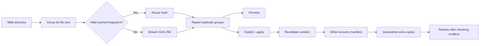

<div align="center">

# FileKeeper

**Find duplicate files. Review the plan. Keep a way back.**

A Python CLI with incremental duplicate detection, resumable quarantine and restore, and reproducible performance benchmarks.

[](https://github.com/darshmahadevia/filekeeper/actions/workflows/tests.yml)


[Quick start](#quick-start) · [Usage](#usage) · [Design](#design) · [Benchmarks](#benchmarks) · [Tests](#tests) · [Learning guide](LEARNING.md)

</div>

## Why FileKeeper?

Renamed downloads and copied folders can contain identical files. FileKeeper compares their contents, shows which copy it will keep, and lets you quarantine the extras. Every cleanup records where those files came from so you can restore them later.

Cleanup is a preview unless you explicitly add `--apply`. Quarantine preserves the files on disk; it does **not** free storage space. There is no permanent-delete command.

## Quick start

Requires Python 3.11 or newer. No runtime packages or external services are needed.

```bash
git clone https://github.com/darshmahadevia/filekeeper.git
cd filekeeper
python3 demo.py
```

The demo works entirely inside a temporary directory. It creates sample files, finds a duplicate, quarantines it, and restores it:

```text
Found 1 duplicate group; 2 files hashed.
Quarantined duplicates: 0 duplicate groups remain.
Restored 1 file; all sample files are back.
```

To install the `filekeeper` command:

```bash
python3 -m venv .venv
source .venv/bin/activate
python3 -m pip install -e .
filekeeper --help
```

Cleanup, recovery, and benchmarks target macOS and Linux. Recovery uses POSIX process locks and same-filesystem hard links. The CI workflow targets Linux.

## Usage

Start with a sample folder whose contents are not being modified.

| Command | Behavior |
| --- | --- |
| `python3 -m filekeeper scan ./sample-folder` | Find duplicates and show the retained copy |
| `python3 -m filekeeper scan ./sample-folder --json` | Emit a machine-readable report |
| `python3 -m filekeeper clean ./sample-folder` | Preview cleanup without moving files |
| `python3 -m filekeeper clean ./sample-folder --apply` | Quarantine extra copies and print the run directory |
| `python3 -m filekeeper restore <run-directory>` | Restore a run, or finish an interrupted restore |
| `python3 -m filekeeper resume <run-directory>` | Finish an interrupted cleanup |
| `python3 -m filekeeper status <run-directory>` | Inspect saved progress and current file locations as JSON |
| `python3 -m filekeeper scan ./sample-folder --cache ./hashes.sqlite3` | Opt in to an incremental scan using a SQLite hash cache |

For example, restore a run using the exact directory printed by cleanup:

```bash
python3 -m filekeeper restore ./sample-folder/.filekeeper-trash/RUN_ID
```

FileKeeper keeps the **lexicographically first relative path** in each duplicate group. Review that choice in the preview. Exit status is `0` for success, `1` for operational or scan errors, and `2` for invalid CLI arguments.

## Design



### Read less, keep memory bounded during hashing

Files with unique sizes cannot be duplicates, so FileKeeper never hashes them. Matching-size candidates are read in 1 MiB chunks and grouped by SHA-256. Empty files are skipped because they contribute no content bytes to reclaim.

A scan takes O(N + B) time apart from sorting, where N is the file count and B is the candidate bytes read. It stores O(N) file paths and uses a fixed-size buffer while hashing. Quarantine performs additional verification reads, including repeated reads of the retained copy when a group has multiple duplicates.

### Reuse hashes on repeat scans

Caching is opt-in. Plain `scan` and cleanup previews do not write a cache. Pass the same database path on successive scans:

```bash
python3 -m filekeeper scan ./sample-folder --cache ./hashes.sqlite3
python3 -m filekeeper scan ./sample-folder --cache ./hashes.sqlite3 --json
```

SQLite keys each hash by canonical root and relative path. Reuse requires matching device, inode, size, modification time, and change time. The metadata is checked again after lookup. An edited, replaced, or renamed file is rehashed. Successful scans prune entries that are no longer candidates, independently for each root.

JSON reports include `files_hashed`, `bytes_hashed`, and `cache_hits`. Content-byte counts cover successful hashing reads during scanning; they exclude metadata, SQLite I/O, and cleanup verification. The selected cache and its sidecar files are excluded if they live inside the scanned root. Put the cache outside that folder so it also stays out of later uncached scans.

The cache is an optimization, not proof of file contents. Cleanup always rehashes both copies before moving, including when a cached report was used. Corrupt or unsupported databases produce an error rather than being silently replaced. Choose a new cache path or remove a cache you no longer need to rebuild it.

### Make cleanup resumable

The cleanup writes a versioned manifest before moving the first file. Each entry records its original path, quarantine location, retained copy, expected hash, and progress. Checkpoints use a flushed temporary file followed by atomic replacement. The stored files receive numbered names to avoid filename collisions.

```text
sample-folder/
├── notes.txt
└── .filekeeper-trash/
    └── <run-id>/
        ├── manifest.json
        └── files/
            └── 00000000
```

Each move creates a hard link at the destination before removing the source name. Recovery checks actual file locations and inode identities rather than trusting a checkpoint alone. If a process dies between those steps, both names point to the same file and recovery safely finishes the operation. Independent files remain a conflict even if their contents match.

```bash
python3 -m filekeeper status ./sample-folder/.filekeeper-trash/RUN_ID
python3 -m filekeeper resume ./sample-folder/.filekeeper-trash/RUN_ID
# Or undo the partial cleanup:
python3 -m filekeeper restore ./sample-folder/.filekeeper-trash/RUN_ID
```

Run `restore` again to finish an interrupted restore. Once restoration begins, `resume` refuses to restart cleanup. Repeating a completed operation changes no files. A per-root OS lock prevents cooperating FileKeeper processes from changing the same root concurrently and releases automatically if a process dies. A new cleanup refuses to start while an earlier run is unfinished.

Version 1 manifests from the original release remain recoverable and are upgraded when recovery writes its next checkpoint. Status shows the last recorded phase and current path existence; it does not verify content or promise a consistent view while another process is working.

### Check before changing files

- Revalidate the duplicate and retained copy against the scanned hash before moving.
- Refuse cleanup when the scan reports unreadable files or directory errors.
- Skip symbolic links and repeated hard-link identities during scans.
- Reject path traversal and symlink paths during quarantine and restore.
- Verify quarantined content before restoring it.
- Refuse to overwrite an existing destination. Restore creates a hard link first, which fails if the destination name is already occupied.

## Benchmarks

```bash
python3 -m benchmarks.run --files 128 --size-kib 256 --repeats 5 \
  --output benchmarks/results/local.json
```

The harness generates deterministic unique-size, duplicate-heavy, and mixed folders. It compares uncached scans, first cached scans, and repeat cached scans in fresh processes. It verifies identical duplicate results across modes and records every timing sample, content bytes hashed, cache hits, and peak process RSS.

Measured locally on Python 3.12.12, macOS arm64, with 128 files per profile and five repetitions:

| Dataset | Uncached median | First cached median | Repeat cached median | Content bytes, uncached → repeat |
| --- | ---: | ---: | ---: | ---: |
| Unique sizes | 1.04 ms | 2.27 ms | 1.86 ms | 0 → 0 |
| Duplicate-heavy | 22.02 ms | 25.95 ms | 9.81 ms | 32 MiB → 0 |
| Mixed | 11.58 ms | 14.30 ms | 5.95 ms | 16 MiB → 0 |

The duplicate-heavy workload had about 2.24× lower elapsed time on repeat cached scans. Caching added overhead for unique-size files, which already avoid hashing. These are small local workloads, not a general speed guarantee. See [the methodology and raw results](benchmarks/README.md) for memory measurements and measurement limits.

## Tests

```bash
python3 -m unittest discover -s tests -v
```

The 38 tests use temporary directories and cover:

| Area | Cases |
| --- | --- |
| Detection | Equal content, equal sizes with different content, unique sizes, empty files |
| Filesystem behavior | Symbolic links, hard links, quarantine exclusion |
| Content changes | Modified retained copy, modified duplicate, tampered quarantined file |
| Recovery | Actual process exits after link, checkpoint, and unlink; resume; rollback; conflicts; root locks; legacy manifests |
| Caching | Warm hits, same-size edits, restored timestamps, file replacement, pruning, shared roots, corrupt databases, cleanup revalidation |
| Benchmarks | Fixture contents, worker subprocesses, matching results across modes, reported metrics |
| Input and CLI | Manifest path traversal, scan errors, preview behavior, JSON output |

GitHub Actions runs this suite on Linux with Python 3.11, 3.12, and 3.13. The badge above links to the actual results.

## Project layout

```text
filekeeper/
├── filekeeper/
│   ├── __main__.py    # CLI arguments, output, and exit codes
│   ├── core.py        # Scanning and report metrics
│   ├── cache.py       # SQLite cache and metadata validation
│   ├── fs.py          # Path checks and streaming hashes
│   └── operations.py  # Operation journal, locking, and recovery
├── benchmarks/
│   ├── run.py         # Reproducible workloads and isolated measurements
│   └── results/       # Raw measured samples
├── tests/            # Detection, caching, process failure, and benchmark tests
├── demo.py           # Self-contained round-trip demo
├── pyproject.toml    # Package metadata and CLI entry point
├── LEARNING.md       # Code walkthrough and extension exercises
└── RESUME.md         # Project description and interview preparation
```

## Limits and tradeoffs

This version targets a quiet folder on one local filesystem. The root lock coordinates FileKeeper operations using that same root, but does not stop other applications, overlapping scan roots, or malicious path changes. It does not eliminate every race between checking a path and changing it. A metadata cache cannot detect content changes that a filesystem fails to reflect in the recorded metadata. Use uncached scans when you need fresh content reads.

Recovery is tested against abrupt process exits. Files and checkpoint directories are flushed, but this is not a guarantee against hardware failure or power loss. Nested mount points can cause cross-filesystem link failures. Cleanup and restore both require hard-link support. Renaming the root directory after quarantine causes the manifest root check to fail.
SHA-256 matches are treated as equal content without a final byte-for-byte comparison. The duplicate-byte total counts matching content, not physical storage savings. Quarantine manifests contain original file paths and should be handled with the same privacy expectations as the scanned folder.

## What to build next

- Exclusion patterns for generated files and selected directories.
- Configurable retention rules, such as keeping the oldest copy.
- Progress reporting and cancellation for long scans.
- Larger benchmarks on multiple machines and storage devices.

See the [learning guide](LEARNING.md) for exercises and the [interview notes](RESUME.md) for questions about the implementation and its tradeoffs.
