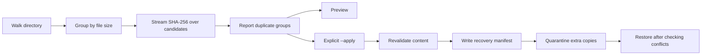

<div align="center">

# FileKeeper

**Find duplicate files. Review the plan. Keep a way back.**

A Python CLI that detects identical files by content and moves extra copies into a reversible quarantine.

[](https://github.com/darshmahadevia/filekeeper/actions/workflows/tests.yml)


[Quick start](#quick-start) · [Usage](#usage) · [Design](#design) · [Tests](#tests) · [Learning guide](LEARNING.md)

</div>

## Why FileKeeper?

Renamed downloads and copied folders can contain identical files. FileKeeper compares their contents, shows which copy it will keep, and lets you quarantine the extras. Every cleanup records where those files came from so you can restore them later.

Cleanup is a preview unless you explicitly add `--apply`. Quarantine preserves the files on disk; it does **not** free storage space. There is no permanent-delete command.

## Quick start

Requires Python 3.11 or newer. No runtime packages or external services are needed.

```bash
git clone https://github.com/darshmahadevia/filekeeper.git
cd filekeeper
python3 demo.py
```

The demo works entirely inside a temporary directory. It creates sample files, finds a duplicate, quarantines it, and restores it:

```text
Found 1 duplicate group; 2 files hashed.
Quarantined duplicates: 0 duplicate groups remain.
Restored 1 file; all sample files are back.
```

To install the `filekeeper` command:

```bash
python3 -m venv .venv
source .venv/bin/activate
python3 -m pip install -e .
filekeeper --help
```

On Windows, activate the environment with `.venv\Scripts\activate` instead. The filesystem behavior has been tested locally on macOS; the CI workflow targets Linux.

## Usage

Start with a sample folder whose contents are not being modified.

| Command | Behavior |
| --- | --- |
| `python3 -m filekeeper scan ./sample-folder` | Find duplicates and show the retained copy |
| `python3 -m filekeeper scan ./sample-folder --json` | Emit a machine-readable report |
| `python3 -m filekeeper clean ./sample-folder` | Preview cleanup without moving files |
| `python3 -m filekeeper clean ./sample-folder --apply` | Quarantine extra copies and print the run directory |
| `python3 -m filekeeper restore <run-directory>` | Restore a quarantine run without overwriting files |

For example, restore a run using the exact directory printed by cleanup:

```bash
python3 -m filekeeper restore ./sample-folder/.filekeeper-trash/RUN_ID
```

FileKeeper keeps the **lexicographically first relative path** in each duplicate group. Review that choice in the preview. Exit status is `0` for success, `1` for operational or scan errors, and `2` for invalid CLI arguments.

## Design



### Read less, keep memory bounded during hashing

Files with unique sizes cannot be duplicates, so FileKeeper never hashes them. Matching-size candidates are read in 1 MiB chunks and grouped by SHA-256. Empty files are skipped because they contribute no content bytes to reclaim.

A scan takes O(N + B) time apart from sorting, where N is the file count and B is the candidate bytes read. It stores O(N) file paths and uses a fixed-size buffer while hashing. Quarantine performs additional verification reads, including repeated reads of the retained copy when a group has multiple duplicates.

### Make cleanup reversible

The cleanup writes a manifest before moving the first file. Each entry records the original relative path, quarantine location, retained copy, and expected hash. The stored files receive numbered names to avoid filename collisions.

```text
sample-folder/
├── notes.txt
└── .filekeeper-trash/
    └── <run-id>/
        ├── manifest.json
        └── files/
            └── 00000000
```

If a move fails halfway through, the manifest still describes the full plan. Restore distinguishes files already in their original location from files that need to return.

### Check before changing files

- Revalidate the duplicate and retained copy against the scanned hash before moving.
- Refuse cleanup when the scan reports unreadable files or directory errors.
- Skip symbolic links and repeated hard-link identities during scans.
- Reject path traversal and symlink paths during quarantine and restore.
- Verify quarantined content before restoring it.
- Refuse to overwrite an existing destination. Restore creates a hard link first, which fails if the destination name is already occupied.

## Tests

```bash
python3 -m unittest discover -s tests -v
```

The 14 tests use temporary directories and cover:

| Area | Cases |
| --- | --- |
| Detection | Equal content, equal sizes with different content, unique sizes, empty files |
| Filesystem behavior | Symbolic links, hard links, quarantine exclusion |
| Content changes | Modified retained copy, modified duplicate, tampered quarantined file |
| Recovery | Round trip, repeated restore, interrupted quarantine, destination conflicts |
| Input and CLI | Manifest path traversal, scan errors, preview behavior, JSON output |

GitHub Actions runs this suite on Linux with Python 3.11, 3.12, and 3.13. The badge above links to the actual results.

## Project layout

```text
filekeeper/
├── filekeeper/
│   ├── __main__.py    # CLI arguments, output, and exit codes
│   └── core.py        # Scanning, hashing, quarantine, and restore
├── tests/
│   └── test_core.py   # Filesystem and CLI behavior tests
├── demo.py            # Self-contained round-trip demo
├── pyproject.toml     # Package metadata and CLI entry point
├── LEARNING.md        # Code walkthrough and extension exercises
└── RESUME.md          # Project description and interview preparation
```

## Limits and tradeoffs

This version targets a quiet folder on one local filesystem. It does not coordinate concurrent cleanups or eliminate every race between checking a path and moving it. Do not treat it as protection against another process deliberately modifying filesystem paths. The manifest supports recovery from interrupted moves, but does not guarantee recovery after power loss.

Nested mount points can cause cross-filesystem move failures. Restore requires hard-link support. An interruption between creating a restored link and removing its quarantine link leaves both names; a retry reports a conflict that needs manual inspection. Renaming the root directory after quarantine causes the manifest root check to fail.

SHA-256 matches are treated as equal content without a final byte-for-byte comparison. The duplicate-byte total counts matching content, not physical storage savings. Quarantine manifests contain original file paths and should be handled with the same privacy expectations as the scanned folder.

## What to build next

- Exclusion patterns for generated files and selected directories.
- Configurable retention rules, such as keeping the oldest copy.
- Reproducible benchmarks for unique-size and duplicate-heavy folders.
- Recovery for an interrupted restore that leaves two names for the same inode.

See the [learning guide](LEARNING.md) for exercises and the [interview notes](RESUME.md) for questions about the implementation and its tradeoffs.
